# Condor estate architecture (agent-oriented)

Audience: an agent that needs the estate's real topology to build
collectors, validate dependency findings, or reason about blast radius —
not a marketing diagram. Every node below is a real resource; exact IDs
live in `estate/verify/refs.json` and `estate/clickops/manifest.json`
(resolve those live, IDs here can drift — see `docs/DISCOVERY-CHECKLIST.md`
for the same caveat). AWS service names are used verbatim so the diagram
reads the same way AWS's own architecture-icon set would label it.

Account: `337058058699` (single account, single region `us-east-1`,
per ADR-037). VPC `condor-vpc`, CIDR `10.20.0.0/16`, 4 subnet tiers:
public, app, data, and an isolated `promo` subnet with no NAT/IGW route.

```mermaid
graph TB
    subgraph GH["GitHub (CloudCraftersOrg org, external)"]
        GH_TIENDA["condor-tienda repo"]
        GH_PAGOS["condor-pagos repo"]
        GH_REPORTES["condor-reportes repo"]
        GH_INVENTARIO["condor-inventario repo"]
        GH_HARNESS["condor-harness repo<br/>(commits.yml, inventario-push.yml,<br/>tienda-approve.yml)"]
        GH_DISCOVERY["discovery repo<br/>(this repo - IaC, answer key,<br/>estate/harness/ledger.jsonl)"]
    end

    subgraph AWS["AWS Account 337058058699 (us-east-1)"]
        subgraph GLOBAL["Account-wide / regional services (outside the VPC)"]
            CUR["AWS Billing Data Exports<br/>CUR 2.0 -> S3 condor-cur-&lt;acct&gt;<br/>Parquet, daily, per billing period"]
            CO["Compute Optimizer<br/>(account enrolled, 14-day<br/>recommendation window)"]
            COH["Cost Optimization Hub"]
            CT["CloudTrail: condor-trail<br/>-> S3 condor-trail-&lt;acct&gt;<br/>mgmt events + S3 data events<br/>on condor-tfstate/*"]
            CFG["AWS Config (2 regions:<br/>us-east-1 + sa-east-1 denied-region canary)"]
            TFSTATE["S3 condor-tfstate-&lt;acct&gt;<br/>Terraform state, per layer"]
            LEDGERS3["S3 condor-harness-ledger-&lt;acct&gt;<br/>(untagged - platform must never read it)"]
            IAM["IAM: condor-bootstrap role,<br/>condor-sandbox-boundary,<br/>dev.juan / dev.maria (static keys),<br/>GitHub OIDC provider"]
        end

        subgraph VPC["VPC condor-vpc (10.20.0.0/16)<br/>Flow Logs (ALL) -> S3 condor-flowlogs-&lt;acct&gt;, Parquet"]
            subgraph PUB["Public subnets"]
                NAT["NAT Gateway"]
            end

            subgraph APPSUB["App subnets"]
                JENKINS["EC2 condor-jenkins<br/>Amazon Linux 2 (past EOS)<br/>Jenkins 2.516.1, AdministratorAccess role<br/>platform_tooling, not an app"]
                RUNNER["EC2 condor-gh-runner<br/>self-hosted GitHub Actions runner<br/>platform_tooling"]

                TIENDA_ALB["ALB (Tienda)"]
                TIENDA_ASG["ASG condor-tienda<br/>EC2, Python/Flask+gunicorn<br/>systemd timer: GET /checkout every 1min"]

                REPORTES_ALB["ALB condor-reportes (internal)<br/>DNS: reportes.condor.internal"]
                REPORTES_ASG["ASG condor-reportes<br/>EC2, Java/Spring, CodeDeploy target"]
                REPORTES_WORKER["EC2 reportes-worker<br/>SSM Agent disabled (AK-COV-02)<br/>systemd timer: GET /report every 1min"]

                FACTURACION["EC2 condor-facturacion<br/>Windows Server 2016 + SQL Server 2019<br/>Standard (license-included)<br/>no pipeline, tag:app=facturacion only"]

                PAGOS_EKS["EKS condor-pagos (v1.34)<br/>Node.js/Express pods<br/>AWS LB Controller via Pod Identity"]
                PAGOS_NLB["NLB (internal, k8s-managed)<br/>listener :8080"]

                INVENTARIO_ECS["ECS Fargate condor-inventario<br/>Python, reads Tienda's RDS via<br/>inventario_ro (read-only user)<br/>plaintext API_TOKEN in task def (AK-APP-03)"]
            end

            subgraph DATASUB["Data subnets"]
                TIENDA_RDS["RDS Postgres condor-tienda-db<br/>single instance"]
                PAGOS_AURORA["Aurora MySQL condor-pagos-db<br/>cluster + 1 instance<br/>param group condor-pagos-params"]
            end

            subgraph PROMOSUB["Promo subnet (isolated - no NAT/IGW)"]
                PROMO["EC2 promo-2024-instance<br/>no instance profile, no tags,<br/>unattached EBS + unassociated EIP<br/>decommission candidate (AK-DEC-01)"]
            end
        end
    end

    GH_TIENDA -->|CodeStarConnections webhook| CODEPIPELINE["CodePipeline condor-tienda<br/>Source->Build(CodeBuild)->Approve->Deploy(CodeDeploy)"]
    CODEPIPELINE --> TIENDA_ASG
    GH_TIENDA -.->|Jenkinsfile, second pipeline| JENKINS
    JENKINS -.->|CodeDeploy| TIENDA_ASG

    GH_PAGOS -->|GitHub Actions deploy.yml,<br/>OIDC to condor-pagos-deploy role| RUNNER
    RUNNER -->|helm upgrade| PAGOS_EKS
    GH_PAGOS -.->|Jenkinsfile, second pipeline| JENKINS
    JENKINS -.->|helm upgrade| PAGOS_EKS

    GH_REPORTES -->|Jenkinsfile, only pipeline,<br/>no approval stage| JENKINS
    JENKINS -->|CodeDeploy| REPORTES_ASG

    JENKINS -.->|facturacion-nightly-export job,<br/>defined only in Jenkins, no repo| FACTURACION

    GH_INVENTARIO -.->|no CI/CD - image built and<br/>pushed manually by dev.juan| INVENTARIO_ECS

    GH_HARNESS -->|commits.yml: round-robin commits,<br/>FAIL_BUILD/FAIL_DEPLOY markers| GH_TIENDA
    GH_HARNESS --> GH_PAGOS
    GH_HARNESS --> GH_REPORTES
    GH_HARNESS -->|inventario-push.yml, dev.juan keys| INVENTARIO_ECS
    GH_HARNESS -->|appends every run| GH_DISCOVERY
    GH_HARNESS -->|uploads ledger, OIDC role<br/>condor-harness-uploader| LEDGERS3

    TIENDA_ALB --> TIENDA_ASG
    TIENDA_ASG -->|checkout POSTs to /pay| PAGOS_NLB
    PAGOS_NLB --> PAGOS_EKS
    TIENDA_ASG --> TIENDA_RDS
    PAGOS_EKS --> PAGOS_AURORA

    REPORTES_ALB --> REPORTES_ASG
    REPORTES_WORKER -->|GET /report every 1min| REPORTES_ALB

    INVENTARIO_ECS -->|read-only, cross-app| TIENDA_RDS

    VPC -.->|VPC Flow Logs| CFG
```

## Real dependency edges (what a collector should actually find)

| From | To | Evidence | Answer-key ID |
|---|---|---|---|
| Tienda ASG (`/checkout`) | Pagos NLB `:8080` (`/pay`) | flow logs (ACCEPT), ELB target health | AK-DEP-01 |
| Inventario ECS task | Tienda RDS `:5432` (`inventario_ro`) | flow logs (ACCEPT), RDS user grants | AK-DEP-02 |
| reportes-worker | Reportes ALB `:80` (`/report`) | flow logs only — deliberately weak signal, no tags/IaC link | AK-GRP-06 |
| Jenkins | Tienda ASG, Pagos EKS, Reportes ASG, Facturación (nightly job) | CloudTrail (CodeDeploy/helm/SSM calls from Jenkins' instance role) | AK-PIP-01, AK-DEP-03 |
| GitHub Actions runner | Pagos EKS | CloudTrail (`AssumeRoleWithWebIdentity` + `helm upgrade` via `kubectl` API calls), OIDC `job_workflow_ref` | AK-PIP-01 |
| dev.juan (static keys) | Inventario ECR + ECS | CloudTrail (`PutImage`, `UpdateService` under an IAM user identity, not a role) | AK-PIP-02 |
| dev.maria (static keys) | Pagos Terraform state (S3) + `condor-pagos-params` | CloudTrail S3 data events (read the trail's delivered logs directly, not `LookupEvents`) + RDS `ModifyDBClusterParameterGroup` | AK-PIP-03, AK-INF-08 |

## What's deliberately NOT connected

- `promo-2024-instance` — isolated subnet, no NAT/IGW, no instance profile, no tags, ungrouped (AK-GRP-07). Its own CodePipeline exists but its target CloudFormation stack was deleted after one run (AK-PIP-08, `dead_pipeline`).
- `condor-jenkins` and `condor-gh-runner` — platform tooling, deliberately excluded from every app's grouping (AK-GRP-08, AK-GRP-09) even though operationally central to every deploy.
- `inventario` and `facturacion` — no CI/CD pipeline at all (AK-PIP-11); facturacion's only automation is a Jenkins-only nightly export job with no backing repo (AK-PIP-07, AK-DEP-03).
- The discovery platform itself (Phase 2+, tagged `managed-by=discovery-platform` once built) — must be excluded from scope and cost (AK-COV-03), and must never read `condor-harness-ledger-<acct>` (evaluation-harness-only data).

## Identity model (relevant to pipeline/security findings)

- `condor-bootstrap` — the only identity with write access to `estate/`, boundary-attached, no AWS-managed `AdministratorAccess` (ADR-045).
- `dev.juan`, `dev.maria` — planted human-identity IAM users with long-lived static access keys, stored in Secrets Manager (`condor/harness/dev-juan`, `condor/harness/dev-maria`) and also present in Jenkins' own credential store (AK-PIP-04, alongside `svc.jenkins-export`) — the static-keys finding is about credential material existing in *both* places.
- `tienda-codebuild-role` and `condor-jenkins-instance-profile` both carry `AdministratorAccess` (AK-PIP-05) — real over-permissioning, not simulated.
- GitHub OIDC federation (one provider, account-wide) trusts specific `job_workflow_ref` values per workflow file+branch — not just per-repo — see `estate/iac/*/iam_deploy.tf` and `estate/iac/harness/iam_uploader.tf` for the pattern.
